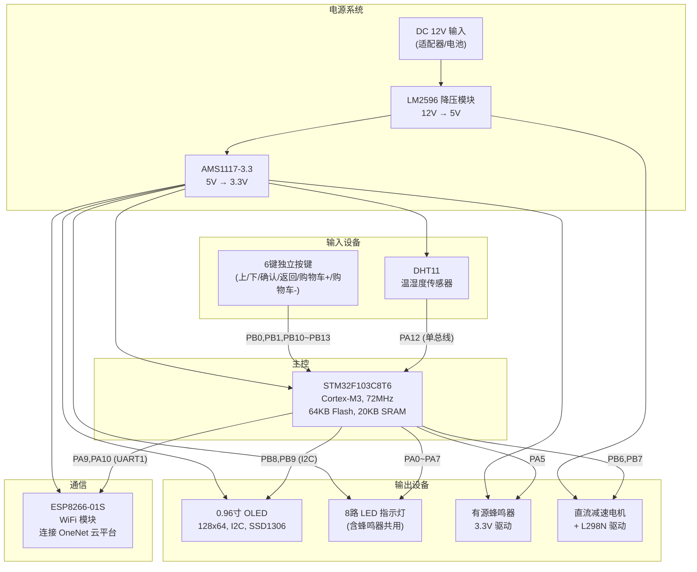

# 基于STM32的自动售货机 — 原理图设计文档

> **MCU**: STM32F103C8T6 | **固件仓库**: Auto-Dealer-Based-On-STM32  
> **设计工具**: 本原理图适配 立创EDA / Altium Designer / KiCad 均可复现

---

## 目录

1. [系统总体框图](#1-系统总体框图)
2. [STM32F103C8T6 最小系统](#2-stm32f103c8t6-最小系统)
3. [电源电路](#3-电源电路)
4. [OLED 显示接口](#4-oled-显示接口)
5. [ESP8266 WiFi 模块接口](#5-esp8266-wifi-模块接口)
6. [DHT11 温湿度传感器](#6-dht11-温湿度传感器)
7. [按键输入电路](#7-按键输入电路)
8. [LED 指示电路](#8-led-指示电路)
9. [蜂鸣器驱动电路](#9-蜂鸣器驱动电路)
10. [电机驱动电路 (L298N)](#10-电机驱动电路-l298n)
11. [完整引脚对照表](#11-完整引脚对照表)
12. [整机互联拓扑图](#12-整机互联拓扑图)
13. [BOM 物料清单](#13-bom-物料清单)
14. [接线注意事项](#14-接线注意事项)

---

## 1. 系统总体框图



---

## 2. STM32F103C8T6 最小系统

### 2.1 原理图

```
                          STM32F103C8T6 (LQFP-48)
                    ┌─────────────────────────────────┐
                    │                                 │
               VBAT │1                          48 VDD│──┼── +3.3V
                    │                           47 VSS│──┼── GND
              PC13  │2                          46 PB9│──┼── OLED_SDA (I2C)
         OSC32_IN   │3  PC14                 45 PB8│──┼── OLED_SCL (I2C)
         OSC32_OUT  │4  PC15                 44 PB7│──┼── MOTOR_B
                    │5  PA0  LED0           43 PB6│──┼── MOTOR_A
                    │6  PA1  LED1           42 PB5│
                    │7  PA2  LED2           41 PB4│
                    │8  PA3  LED3           40 PB3│
                    │9  PA4  LED4           39 PB2│
                    │10 PA5  BEEP/LED5      38 PB1│──┼── KEY_BACK
                    │11 PA6  LED6           37 PB0│──┼── KEY_OK
                    │12 PA7  LED7           36 PA15│
           NRST ────│13                    35 PA12│──┼── DHT11_DATA
                    │14 VSS          34 PA11│
              +3.3V │15 VDD          33 PA10│──┼── USART1_RX (ESP TX)
                    │16 PA8            32 PA9│──┼── USART1_TX (ESP RX)
           BOOT0 ── │17 PB15         31 PA8│
           BOOT1 ── │18 PB14         30 PB13│──┼── KEY_DOWN
                    │19 PB13 KEY_DOWN     29 PB12│──┼── KEY_UP
                    │20 PB12 KEY_UP       28 VDD│──┼── +3.3V
                    │21 VSS                      27 VSS│──┼── GND
                    │22 VDD          26 PB11│──┼── KEY_CART-
                    │23 PB10 KEY_CART+     25 PB10│──┼── (reserved)
                    │24 PB11 KEY_CART-               │
                    │                                 │
                    └─────────────────────────────────┘

        晶振电路:                         复位电路:
        ┌─────────────┐                 ┌─────────────┐
        │  OSC_IN  OSC_OUT │                 +3.3V
        │   │        │    │                   │
        │   ├─[8MHz]─┤    │                  [10KΩ]
        │   │        │    │                   │
        │  ─┴─      ─┴─   │              NRST ├──── [100nF] ──── GND
        │ [22pF]   [22pF]  │                   │
        │  ─┬─      ─┬─   │                  ╱ ╲  (复位按键)
        │   │        │    │                 ╱ ○ ╲
        │  GND      GND   │                 ╲   ╱
        └─────────────┘                 ╲ ╱
                                            │
                                           GND
    ```

### 2.2 元件参数

| 元件 | 参数 | 数量 | 说明 |
|------|------|------|------|
| 主控芯片 | STM32F103C8T6 | 1 | LQFP-48 封装 |
| 主晶振 | 8MHz 无源晶振 | 1 | 配 22pF 负载电容 ×2 |
| RTC晶振(可选) | 32.768kHz | 1 | 配 10pF 负载电容 ×2 |
| 复位电阻 | 10KΩ 0603 | 1 | 上拉至 3.3V |
| 复位电容 | 100nF 0603 | 1 | 对地去抖 |
| 复位按键 | 6×6mm 轻触开关 | 1 | 低电平复位 |
| 去耦电容 | 100nF 0603 | 4 | 每个 VDD 引脚各1个 |
| 滤波电容 | 10μF 钽电容 | 1 | VDD 总滤波 |
| BOOT0 跳线 | 2.54mm 排针+跳线帽 | 1 | 默认接 GND |
| BOOT1 跳线 | 2.54mm 排针+跳线帽 | 1 | 默认接 GND |
| SWD调试口 | 4Pin 2.54mm 排针 | 1 | SWDIO/SWCLK/3.3V/GND |

---

## 3. 电源电路

### 3.1 原理图

```
        Power Tree (电源树)
        ═══════════════════════════════════════

        DC 12V 输入                        DC 5V 输出                    DC 3.3V 输出
    (适配器 12V/2A)                  (供 L298N 逻辑 + 外设)        (供 STM32/ESP8266/OLED/DHT11)

    ╔══════════════╗       ╔══════════════╗       ╔══════════════╗
    ║  DC Jack     ║       ║  LM2596      ║       ║  AMS1117-3.3 ║
    ║  5.5×2.1mm   ║──────→║  Buck 模块    ║──────→║  LDO 模块     ║───→ +3.3V
    ║              ║       ║  12V → 5V    ║       ║  5V → 3.3V   ║
    ╚══════════════╝       ╚══════════════╝       ╚══════════════╝
           │                      │                        │
           │ +12V                 │ +5V                    │ +3.3V
           ├──→ L298N 电机电源     ├──→ USB母座(调试)       ├──→ STM32 VDD
           │                      ├──→ 散热风扇(可选)      ├──→ OLED VCC
           │                      │                        ├──→ ESP8266 VCC
           │                      │                        ├──→ DHT11 VCC
           │                      │                        ├──→ LED 阳极电源
           │                      │                        └──→ 蜂鸣器

        ┌─────────────────────────────────────────────────────────┐
        │                   LM2596 模块 (降压)                      │
        │                                                         │
        │   +12V ────┬── LM2596-5.0 ──┬─── +5V                   │
        │            │    IN    OUT   │                            │
        │            │    GND   FB   │                            │
        │            │     │     │    │                            │
        │           ===  100μF   ─┴─ L1 33μH                      │
        │           GND   35V    ─┬─                              │
        │                        ─┴─ 220μF 16V                    │
        │                         │                               │
        │           SS34 续流二极管 (从 OUT 到 GND，反接)           │
        │                                                         │
        └─────────────────────────────────────────────────────────┘

        ┌─────────────────────────────────────────────────────────┐
        │                  AMS1117-3.3 模块 (LDO)                  │
        │                                                         │
        │   +5V ─────┬── AMS1117-3.3 ──┬─── +3.3V                │
        │            │   IN      OUT  │                           │
        │            │   GND(TAB)     │                           │
        │            │     │          │                           │
        │           ===  10μF        === 10μF                     │
        │           GND  钽电容       GND 钽电容                   │
        │            │              │                             │
        │           GND            GND                            │
        └─────────────────────────────────────────────────────────┘

        ┌─────────────────────────────────────────────────────────┐
        │               12V→5V→3.3V 供电汇总                       │
        │                                                         │
        │  【12V 轨】─ L298N 电机驱动 (VMOT，峰值 2A)               │
        │  【5V 轨】 ─ L298N 逻辑供电 (VSS，~50mA)                  │
        │             ─ AMS1117 输入端                             │
        │  【3.3V轨】─ STM32F103C8T6 (~50mA)                       │
        │             ─ ESP8266-01S (峰值 ~300mA，平均 ~80mA)       │
        │             ─ OLED SSD1306 (~20mA)                       │
        │             ─ DHT11 (~2.5mA)                             │
        │             ─ 8×LED (~5mA×8=40mA)                        │
        │             ─ 有源蜂鸣器 (~30mA)                          │
        │                                                         │
        │  3.3V 总电流估算: ~442mA (建议提供 ≥800mA 余量)           │
        │  5V 总电流估算:   ~500mA (建议 LM2596 1A 以上)            │
        └─────────────────────────────────────────────────────────┘
```

### 3.2 元件参数

| 元件 | 参数 | 数量 | 封装 |
|------|------|------|------|
| DC 电源插座 | 5.5×2.1mm DC Jack | 1 | 直插 |
| LM2596 降压模块 | 12V→5V, 3A | 1 | 成品模块 |
| AMS1117-3.3 | 3.3V LDO, 1A | 1 | SOT-223 |
| 输入电容 (12V) | 100μF/35V 铝电解 | 1 | 直插 |
| 输出电容 (5V) | 220μF/16V 铝电解 | 1 | 直插 |
| 输入电容 (AMS1117) | 10μF 钽电容 | 1 | 1206 |
| 输出电容 (AMS1117) | 10μF 钽电容 | 1 | 1206 |
| 续流二极管 | SS34 (肖特基 3A/40V) | 1 | SMC |
| 电源开关 | 自锁开关 KCD1-101 | 1 | 面板安装 |
| 电源指示灯 | 红色 LED + 1KΩ 限流电阻 | 1 | 5mm LED |
| 去耦电容 (3.3V总线) | 100nF 0603 | 6 | 0603 |

---

## 4. OLED 显示接口

### 4.1 原理图

```
              STM32F103C8T6                          0.96" OLED (SSD1306)
              ┌──────────┐                          ┌────────────────┐
              │          │                          │                │
              │     PB8  │──────────────────────────│ SCL            │
              │  (SCL)   │       I2C Clock          │                │
              │     PB9  │──────────────────────────│ SDA            │
              │  (SDA)   │       I2C Data           │                │
              │          │                          │                │
              │          │                          │ VCC ─── +3.3V  │
              │          │                          │ GND ─── GND    │
              │          │                          │                │
              └──────────┘                          └────────────────┘

        I2C 上拉电阻 (如果 OLED 模块板上已有可省略):

                 +3.3V                      +3.3V
                   │                          │
                 [4.7KΩ]                    [4.7KΩ]
                   │                          │
        PB8(SCL)──┼──────── OLED SCL         ┼── PB9(SDA) ── OLED SDA


        OLED 模块规格:
        ┌──────────────────────────────────────────┐
        │  尺寸:      0.96 英寸                      │
        │  分辨率:    128 × 64 像素                  │
        │  驱动芯片:  SSD1306                        │
        │  接口:      I2C (地址 0x3C)                │
        │  工作电压:  3.3V                           │
        │  引脚排列:  VCC/GND/SCL/SDA (4 Pin)        │
        │  颜色:      白色/蓝色双色可选               │
        └──────────────────────────────────────────┘
```

### 4.2 连接

| OLED 模块引脚 | 连接目标 | 备注 |
|---------------|----------|------|
| VCC | +3.3V | |
| GND | GND | |
| SCL | STM32 PB8 | 软件 I2C 时钟 |
| SDA | STM32 PB9 | 软件 I2C 数据 |

> **注**: 代码使用软件 I2C 实现，不使用 STM32 硬件 I2C 外设。上拉电阻通常集成在 OLED 模块 PCB 上，若无则需外加 4.7KΩ ×2。

---

## 5. ESP8266 WiFi 模块接口

### 5.1 原理图

```
              STM32F103C8T6                          ESP8266-01S
              ┌──────────┐                         ┌──────────────┐
              │          │                         │              │
              │     PA9  │──┬──────────────────────│ RXD          │
              │ (TX)     │  │     UART TX          │              │
              │    PA10  │──┼──────────────────────│ TXD          │
              │ (RX)     │  │     UART RX          │              │
              │          │  │                      │              │
              │          │  │                      │ VCC ── +3.3V │
              │          │  │                      │ GND ── GND   │
              │          │  │                      │ CH_PD ── +3.3V│ (使能引脚)
              │          │  │                      │ RST  ── +3.3V │ (通过 10KΩ)
              │          │  │                      │              │
              └──────────┘  │                      └──────────────┘
                            │
        ┌───────────────────┴─────────────────────────────────────┐
        │               电平匹配说明                                │
        │                                                         │
        │  STM32 PA9 (TX)  →  3.3V 电平  →  ESP8266 RXD  ✓ 兼容   │
        │  ESP8266 TXD    →  3.3V 电平  →  STM32 PA10 (RX) ✓ 兼容  │
        │                                                         │
        │  ⚠ ESP8266 峰值电流可达 300mA，3.3V LDO 需足够余量         │
        │  ⚠ ESP8266 CH_PD (EN) 必须接高电平才能工作                 │
        │  ⚠ 建议在 ESP8266 VCC 旁并联 100μF 电解电容 + 100nF 陶瓷   │
        └─────────────────────────────────────────────────────────┘

        ESP8266 电源滤波推荐:

            +3.3V ──┬── 100μF/6.3V ──┬── 100nF ──┬── ESP8266 VCC
                    │    电解电容     │   陶瓷     │
                   GND              GND         GND
```

### 5.2 连接

| ESP8266-01S 引脚 | 连接目标 | 备注 |
|-------------------|----------|------|
| VCC | +3.3V | 需 ≥300mA 驱动能力 |
| GND | GND | |
| RXD | STM32 PA9 (USART1_TX) | 115200 波特率 |
| TXD | STM32 PA10 (USART1_RX) | 115200 波特率 |
| CH_PD (EN) | +3.3V (通过 10KΩ 上拉) | 必须拉高 |
| RST | +3.3V (通过 10KΩ 上拉) | 外部复位 |
| GPIO0 | 悬空 (或 10KΩ 上拉) | 低电平=下载模式 |
| GPIO2 | 悬空 (或 10KΩ 上拉) | 上电需高电平 |

---

## 6. DHT11 温湿度传感器

### 6.1 原理图

```
              STM32F103C8T6                            DHT11 模块
              ┌──────────┐                          ┌──────────────┐
              │          │                          │              │
              │    PA12  │──────────────────────────│ DATA         │
              │          │       单总线              │              │
              │          │                          │ VCC ── +3.3V │
              │          │                          │ GND ── GND   │
              │          │                          │              │
              └──────────┘                          └──────────────┘

        上拉电阻 (DHT11 模块板上通常已有):

                           +3.3V
                             │
                           [4.7KΩ ~ 10KΩ]
                             │
              PA12 ──────────┼──────── DHT11 DATA

        DHT11 模块规格:
        ┌──────────────────────────────────────────┐
        │  温度范围:   0 ~ 50°C (精度 ±2°C)          │
        │  湿度范围:   20 ~ 90% RH (精度 ±5%RH)       │
        │  采样周期:   ≥1 秒                         │
        │  接口:       单总线 (One-Wire)              │
        │  工作电压:   3.3V ~ 5V                      │
        │  引脚排列:   VCC/DATA/NC/GND 或 VCC/DATA/GND│
        └──────────────────────────────────────────┘
```

### 6.2 连接

| DHT11 引脚 | 连接目标 | 备注 |
|------------|----------|------|
| VCC | +3.3V | 兼容 3.3V~5V |
| DATA | STM32 PA12 | 单总线，需 4.7KΩ 上拉 |
| GND | GND | |

---

## 7. 按键输入电路

### 7.1 原理图

```
        6 键独立按键电路 (内部上拉, 按下低电平)

                        按键功能映射:

              上翻 (UP)    下翻 (DOWN)
              ┌─────┐     ┌─────┐
              │ PB12│     │ PB13│
              └──┬──┘     └──┬──┘
                 │            │
          ═══════╪════════════╪═══════
                 │            │
              ┌──┴──┐     ┌──┴──┐     ┌─────┐     ┌─────┐
              │ 上  │     │ 下  │     │确认 │     │返回 │
              │商品 │     │商品 │     │(OK) │     │(BACK)│
              └─────┘     └─────┘     └──┬──┘     └──┬──┘
                                        │            │
                                       PB0          PB1

              商品选择界面:              购物车界面:
              PB12 → 上一商品            PB10 → 数量+1
              PB13 → 下一商品            PB11 → 数量-1
              PB0  → 确认选择            PB0  → 确认结算
              PB1  → 返回首页            (超时自动返回)


        每个按键的电路 (以 PB0 为例):

                        +3.3V
                          │
                    内部上拉 (~40KΩ)
                          │
              ┌───────────┼────── TO STM32 PB0
              │           │
              │     ┌─────┴─────┐
              │     │  10KΩ     │  (可选外部上拉,增强抗干扰)
              │     └─────┬─────┘
              │           │
              │     ┌─────┴─────┐
              │     │     ╱ ╲   │
              │     │    ╱ ○ ╲  │  轻触按键 (6×6mm)
              │     │    ╲   ╱  │
              │     │     ╲ ╱   │
              │     └─────┬─────┘
              │           │
              │          GND
              │
              └──── 消抖电容 100nF (可选,PCB布局时预留)


        6键引脚分配:
        ┌──────────┬──────────┬────────────────────────────┐
        │  按键功能 │ STM32引脚 │  操作界面说明               │
        ├──────────┼──────────┼────────────────────────────┤
        │  上翻     │ PB12     │ 商品选择: 上一个商品         │
        │  下翻     │ PB13     │ 商品选择: 下一个商品         │
        │  确认(OK) │ PB0      │ 选择→确认购买→结算          │
        │  返回     │ PB1      │ 返回上一级 / 首页            │
        │  购物车+  │ PB10     │ 购物车: 同商品数量+1         │
        │  购物车-  │ PB11     │ 购物车: 同商品数量-1         │
        └──────────┴──────────┴────────────────────────────┘
```

### 7.2 元件参数

| 元件 | 参数 | 数量 | 封装 |
|------|------|------|------|
| 轻触按键 | 6×6×5mm, 4脚 | 6 | 直插 |
| 外部上拉电阻(可选) | 10KΩ 0603 | 6 | 0603 |
| 消抖电容(可选) | 100nF 0603 | 6 | 0603 |

> **注**: 代码已启用 STM32 内部上拉 (`GPIO_Mode_IPU`)，硬件上拉电阻非必须，但在工业环境建议保留增强抗干扰。

---

## 8. LED 指示电路

### 8.1 原理图

```
        8路 LED 指示灯 (低电平驱动)

                   +3.3V
                     │
              ┌──────┼──────┬──────┬──────┬──────┬──────┬──────┐
              │      │      │      │      │      │      │      │
             [R]    [R]    [R]    [R]    [R]    [R]    [R]    [R]
           220Ω×8  220Ω   220Ω   220Ω   220Ω   220Ω   220Ω   220Ω
              │      │      │      │      │      │      │      │
             LED    LED    LED    LED    LED    LED    LED    LED
            D0(红) D1(绿) D2(黄) D3(绿) D4(红) D5(黄) D6(红) D7(绿)
              │      │      │      │      │      │      │      │
             PA0    PA1    PA2    PA3    PA4    PA5    PA6    PA7
              │      │      │      │      │      │      │      │
              └──────┴──────┴──────┴──────┴──────┴──────┴──────┘
                               STM32 GPIOA

        单路 LED 电路:
                                             LED电流计算:
                 +3.3V                     ─────────────────
                   │                       ILED = (3.3V - Vf) / R
                 [220Ω]                    = (3.3V - 1.8V) / 220Ω
                   │                       = 1.5V / 220Ω
                  ╱▷  LED                  ≈ 6.8mA
                  ╲▷
                   │
                  PAx (GPIO 低电平点亮)

        LED 功能分配:
        ┌──────┬──────┬──────────────────────────────┐
        │ LED  │ 引脚 │ 用途                         │
        ├──────┼──────┼──────────────────────────────┤
        │ LED0 │ PA0  │ 电源/系统状态指示             │
        │ LED1 │ PA1  │ 商品通道1 状态                │
        │ LED2 │ PA2  │ 商品通道2 状态                │
        │ LED3 │ PA3  │ 商品通道3 状态                │
        │ LED4 │ PA4  │ 商品通道4 状态                │
        │ LED5 │ PA5  │ ⚠ 与蜂鸣器共用,二选一         │
        │ LED6 │ PA6  │ 出货状态指示                  │
        │ LED7 │ PA7  │ WiFi连接状态                  │
        └──────┴──────┴──────────────────────────────┘

        ⚠ PA5 冲突说明:
           PA5 同时被 LED5 和 BEEP 初始化。
           如果同时焊接 LED 和蜂鸣器:
           - 蜂鸣器响时,LED5 也会亮
           - LED5 闪烁时,蜂鸣器可能发出微弱噪音
           建议: 二选一焊接,或通过跳线选择
```

### 8.2 元件参数

| 元件 | 参数 | 数量 | 封装 |
|------|------|------|------|
| LED (红色) | 0805 贴片, Vf≈1.8V | 3 | 0805 |
| LED (绿色) | 0805 贴片, Vf≈2.0V | 3 | 0805 |
| LED (黄色) | 0805 贴片, Vf≈1.9V | 2 | 0805 |
| 限流电阻 | 220Ω 0603 | 8 | 0603 |

---

## 9. 蜂鸣器驱动电路

### 9.1 原理图

```
        有源蜂鸣器驱动 (低电平触发)

        ┌─────────────────────────────────────────────────┐
        │                                                 │
        │    +3.3V                                        │
        │      │                                          │
        │    ┌─┴─┐                                        │
        │    │BEEP│  有源蜂鸣器 (内置振荡器,通直流即响)      │
        │    │   │  工作电压: 3V ~ 5V                      │
        │    └─┬─┘  额定电流: ~30mA                        │
        │      │                                          │
        │    ┌─┴─┐                                        │
        │    │ C │  S8050 NPN 三极管 (开关驱动)             │
        │    └─┬─┘  Ic_max = 500mA                        │
        │      │                                          │
        │     E                                           │
        │      │                                          │
        │     GND                                         │
        │                                                 │
        └─────────────────────────────────────────────────┘

        基极驱动:

                    STM32 PA5 ────[1KΩ]──── B (S8050基极)

        ⚠ PA5 同时驱动 BEEP 和 LED5。由于有源蜂鸣器工作电流 ~30mA,
        而 LED 仅需 ~7mA, 建议优先保证蜂鸣器焊接,LED5 通过跳线可选。

        简化的直接驱动方案 (如果蜂鸣器电流小):

                    PA5 ──── 蜂鸣器 ──── GND

        提示: 代码中 Beep_Init() 将 PA5 配置为推挽输出,
        GPIO_SetBits 关闭蜂鸣器(高电平),GPIO_ResetBits 开启(低电平)。
        蜂鸣器负极接 PA5, 正极接 +3.3V。
```

### 9.2 元件参数

| 元件 | 参数 | 数量 | 封装 |
|------|------|------|------|
| 有源蜂鸣器 | 3.3V 电磁式, ≥85dB | 1 | 直插 12mm |
| NPN 三极管 | S8050 (或 2N3904) | 1 | SOT-23 |
| 基极电阻 | 1KΩ 0603 | 1 | 0603 |
| 续流二极管(可选) | 1N4148 (反向并联蜂鸣器) | 1 | SOD-123 |

---

## 10. 电机驱动电路 (L298N)

### 10.1 原理图

```
        直流电机驱动 — L298N 模块

                     ┌───────────────── L298N 模块 ──────────────────┐
                     │                                               │
        +12V ────────┤ VMOT (电机电源, 12V)                           │
                     │                                               │
        +5V ─────────┤ VSS  (逻辑电源, 5V)   OUT1 ────┬── 直流电机    │
                     │                               │   (减速电机)   │
        GND ─────────┤ GND                  OUT2 ────┘               │
                     │                                               │
        STM32 PB6 ───┤ IN1                                    │      │
        STM32 PB7 ───┤ IN2                                          │
                     │                                               │
        悬空/接GND ──┤ ENA (使能, 跳线帽短接=常使能)                  │
        悬空/接GND ──┤ ENB (未使用)                                   │
                     │                                               │
                     └───────────────────────────────────────────────┘

        电机控制逻辑 (L298N):
        ┌──────┬──────┬────────────────┐
        │ IN1  │ IN2  │  电机状态       │
        │(PB6) │(PB7) │                │
        ├──────┼──────┼────────────────┤
        │  0   │  0   │  停止 (刹车)    │
        │  1   │  0   │  正转 (出货)    │
        │  0   │  1   │  反转           │
        │  1   │  1   │  停止 (刹车)    │
        └──────┴──────┴────────────────┘

        代码中 Motor_Turn() 的逻辑:
        ┌───────────────────────────────────────┐
        │  PB6 = 1  (正转启动)                  │
        │  Delay_ms(2500)  — 电机转动 2.5 秒     │
        │  PB6 = 0  (停止)                      │
        │                                       │
        │  实际使用: 电机正转 2.5 秒推出商品      │
        │  然后停止等待下一次触发                 │
        └───────────────────────────────────────┘
```

### 10.2 连接

| L298N 引脚 | 连接目标 | 备注 |
|------------|----------|------|
| VMOT | DC +12V | 电机供电, 需 ≥1A |
| VSS | DC +5V | 逻辑供电 |
| GND | GND | 需与STM32共地 |
| IN1 | STM32 PB6 | 电机方向控制1 |
| IN2 | STM32 PB7 | 电机方向控制2 |
| ENA | 跳线帽短接至5V (常使能) | 或接PWM调速 |
| ENB | 未使用/悬空 | |
| OUT1 | 直流电机 + | |
| OUT2 | 直流电机 - | |

### 10.3 元件参数

| 元件 | 参数 | 数量 | 说明 |
|------|------|------|------|
| L298N 驱动模块 | 双H桥, 2A/通道 | 1 | 成品模块 |
| 直流减速电机 | 12V, 100~300 RPM | 1 | 扭力视商品重量而定 |
| 续流二极管 | SS34 (L298N 模块已集成) | - | 模块自带 |
| 电机电源滤波电容 | 100μF/25V 铝电解 | 1 | 电机启动去耦 |

---

## 11. 完整引脚对照表

### 11.1 STM32F103C8T6 → 各外设

```
┌────────┬───────────┬──────────────────────┬─────────┬──────────┐
│ 引脚   │ 端口功能  │ 连接目标             │ 模式    │ 备注     │
├────────┼───────────┼──────────────────────┼─────────┼──────────┤
│ PA0    │ GPIO/ADC0 │ LED0 指示灯           │ 推挽输出 │ 低电平点亮│
│ PA1    │ GPIO/ADC1 │ LED1 指示灯           │ 推挽输出 │ 低电平点亮│
│ PA2    │ GPIO/ADC2 │ LED2 指示灯           │ 推挽输出 │ 低电平点亮│
│ PA3    │ GPIO/ADC3 │ LED3 指示灯           │ 推挽输出 │ 低电平点亮│
│ PA4    │ GPIO      │ LED4 指示灯           │ 推挽输出 │ 低电平点亮│
│ PA5    │ GPIO      │ 蜂鸣器 / LED5         │ 推挽输出 │ ⚠共用冲突│
│ PA6    │ GPIO      │ LED6 指示灯           │ 推挽输出 │ 低电平点亮│
│ PA7    │ GPIO      │ LED7 指示灯           │ 推挽输出 │ 低电平点亮│
│ PA9    │ USART1_TX │ ESP8266 RXD           │ 复用推挽 │ 115200bps│
│ PA10   │ USART1_RX │ ESP8266 TXD           │ 上拉输入 │ 115200bps│
│ PA12   │ GPIO      │ DHT11 DATA            │ 上拉输入 │ 单总线   │
│ PB0    │ GPIO      │ 按键: 确认(OK)        │ 上拉输入 │ 按下=0   │
│ PB1    │ GPIO      │ 按键: 返回(BACK)      │ 上拉输入 │ 按下=0   │
│ PB6    │ GPIO      │ L298N IN1 (电机正转)   │ 推挽输出 │          │
│ PB7    │ GPIO      │ L298N IN2 (电机反转)   │ 推挽输出 │          │
│ PB8    │ GPIO      │ OLED SCL (I2C时钟)    │ 推挽输出 │ 软件I2C  │
│ PB9    │ GPIO      │ OLED SDA (I2C数据)    │ 推挽输出 │ 软件I2C  │
│ PB10   │ GPIO      │ 按键: 购物车+         │ 上拉输入 │ 按下=0   │
│ PB11   │ GPIO      │ 按键: 购物车-         │ 上拉输入 │ 按下=0   │
│ PB12   │ GPIO      │ 按键: 上翻 (UP)       │ 上拉输入 │ 按下=0   │
│ PB13   │ GPIO      │ 按键: 下翻 (DOWN)     │ 上拉输入 │ 按下=0   │
├────────┼───────────┼──────────────────────┼─────────┼──────────┤
│ NRST   │ RST       │ 复位电路              │         │          │
│ BOOT0  │ BOOT      │ GND (正常模式)        │         │          │
│ BOOT1  │ BOOT      │ GND (正常模式)        │         │          │
│ OSC_IN │ HSE       │ 8MHz 晶振             │         │          │
│ OSC_OUT│ HSE       │ 8MHz 晶振             │         │          │
│ VDD×4  │ PWR       │ +3.3V                 │         │ 各配100nF│
│ VSS×4  │ PWR       │ GND                   │         │          │
└────────┴───────────┴──────────────────────┴─────────┴──────────┘
```

### 11.2 未使用引脚处理

```
┌─────────┬────────────────────────────────┐
│ 引脚    │ 处理方式                        │
├─────────┼────────────────────────────────┤
│ PA8     │ 悬空 (或 10KΩ 下拉)             │
│ PA11    │ 悬空                            │
│ PA13    │ SWDIO (调试口,预留)             │
│ PA14    │ SWCLK (调试口,预留)             │
│ PA15    │ 悬空                            │
│ PB2     │ 悬空                            │
│ PB3     │ 悬空 (或预留 JTAG)              │
│ PB4     │ 悬空 (或预留 JTAG)              │
│ PB5     │ 悬空                            │
│ PB14    │ 悬空                            │
│ PB15    │ 悬空                            │
│ PC13    │ 悬空 (或接LED,注意电流限制)      │
│ PC14    │ 悬空 (或 RTC 晶振)              │
│ PC15    │ 悬空 (或 RTC 晶振)              │
└─────────┴────────────────────────────────┘
```

---

## 12. 整机互联拓扑图

```
                         整机接线总览
    ═══════════════════════════════════════════════════════════

                         ┌─────────────────────┐
                    ┌────┤   DC 12V 电源适配器   │
                    │    └─────────────────────┘
                    │              │
                    │         ┌────┴────┐
                    │         │  开关    │
                    │         └────┬────┘
                    │              │
              ┌─────┴──────┐  ┌───┴──────┐
              │  LM2596    │  │  L298N   │
              │  12V→5V    │  │  电机驱动  │
              └─────┬──────┘  └──┬───┬───┘
                    │            │   │
              ┌─────┴──────┐   OUT1 OUT2
              │  AMS1117   │     │   │
              │  5V→3.3V   │   ┌─┴───┴─┐
              └─────┬──────┘   │ 直流  │
                    │          │ 电机  │
           +3.3V 总线          └───────┘
              │
    ┌─────────┼─────────┬─────────┬─────────┬─────────┐
    │         │         │         │         │         │
 ┌──┴──┐  ┌──┴──┐  ┌──┴──┐  ┌──┴──┐  ┌──┴──┐  ┌──┴──┐
 │8LED │  │蜂鸣器│  │OLED │  │ESP  │  │DHT11│  │按键 │
 │模块 │  │     │  │0.96"│  │8266 │  │传感器│  │×6   │
 └──┬──┘  └──┬──┘  └──┬──┘  └──┬──┘  └──┬──┘  └──┬──┘
    │        │        │        │        │        │
    └────────┼────────┼────────┼────────┼────────┘
             │        │        │        │
        PA0~PA7  PA5   PB8,PB9 PA9,PA10 PA12  PB0,PB1,PB10~PB13
             │        │        │        │        │
             └────────┴────────┴────────┴────────┘
                            │
                   ┌────────┴────────┐
                   │ STM32F103C8T6    │
                   │ (最小系统板)      │
                   └─────────────────┘
```

---

## 13. BOM 物料清单

### 13.1 核心元件

| 序号 | 元件 | 型号/参数 | 数量 | 封装 | 备注 |
|------|------|-----------|------|------|------|
| 1 | MCU | STM32F103C8T6 | 1 | LQFP-48 | 或最小系统板 |
| 2 | OLED 显示屏 | 0.96寸 SSD1306 I2C | 1 | 模块 | 4Pin 蓝色/白色 |
| 3 | WiFi 模块 | ESP8266-01S | 1 | 模块 | 8Pin 排针 |
| 4 | 温湿度传感器 | DHT11 | 1 | 模块 | 3Pin/4Pin |
| 5 | 电机驱动 | L298N 模块 | 1 | 模块 | 双H桥 |
| 6 | 直流减速电机 | 12V 200RPM | 1 | - | 带减速箱 |

### 13.2 电源

| 序号 | 元件 | 型号/参数 | 数量 | 封装 | 备注 |
|------|------|-----------|------|------|------|
| 7 | 降压模块 | LM2596 DC-DC 12V→5V 3A | 1 | 模块 | 成品模块 |
| 8 | LDO | AMS1117-3.3 SOT-223 | 1 | SOT-223 | 或集成于最小系统板 |
| 9 | DC 电源插座 | DC-005 5.5×2.1mm | 1 | 直插 | 母座 |
| 10 | 12V 电源适配器 | 12V/2A | 1 | - | DC 5.5×2.1mm 公头 |
| 11 | 电源开关 | KCD1-101 船型开关 | 1 | 面板 | 自锁 |
| 12 | 电解电容 | 100μF/35V | 1 | 直插 8mm | 输入滤波 |
| 13 | 电解电容 | 220μF/16V | 1 | 直插 8mm | 输出滤波 |
| 14 | 电解电容 | 100μF/6.3V | 1 | 直插 6mm | ESP8266 去耦 |
| 15 | 钽电容 | 10μF/16V | 2 | 1206 | AMS1117 输入/输出 |
| 16 | 肖特基二极管 | SS34 | 1 | SMC | 续流 |
| 17 | 陶瓷电容 | 100nF | 10 | 0603 | 各处去耦 |

### 13.3 输入/输出

| 序号 | 元件 | 型号/参数 | 数量 | 封装 | 备注 |
|------|------|-----------|------|------|------|
| 18 | 轻触按键 | 6×6×5mm | 6 | 直插 | PB0/1/10/11/12/13 |
| 19 | LED 红色 | 0805 Vf=1.8V | 3 | 0805 | |
| 20 | LED 绿色 | 0805 Vf=2.0V | 3 | 0805 | |
| 21 | LED 黄色 | 0805 Vf=1.9V | 2 | 0805 | |
| 22 | 限流电阻 | 220Ω ±5% | 8 | 0603 | LED 限流 |
| 23 | 有源蜂鸣器 | 3.3V ≥85dB | 1 | 直插 12mm | |
| 24 | NPN 三极管 | S8050 | 1 | SOT-23 | 蜂鸣器驱动 |

### 13.4 无源元件

| 序号 | 元件 | 型号/参数 | 数量 | 封装 | 备注 |
|------|------|-----------|------|------|------|
| 25 | 8MHz 无源晶振 | ±20ppm | 1 | 49S 或 3225 | |
| 26 | 22pF 电容 | NPO/COG | 2 | 0603 | 晶振负载电容 |
| 27 | 10KΩ 电阻 | ±5% | 8 | 0603 | 上拉/复位/BOOT |
| 28 | 1KΩ 电阻 | ±5% | 1 | 0603 | 蜂鸣器基极 |
| 29 | 4.7KΩ 电阻 | ±5% | 2 | 0603 | I2C上拉(备用) |
| 30 | 排针 | 2.54mm 单排 | 若干 | - | 模块连接 |
| 31 | 跳线帽 | 2.54mm | 3 | - | BOOT/EAN |
| 32 | 杜邦线 | 母对母 20cm | 30+ | - | 模块互联 |

---

## 14. 接线注意事项

### 14.1 电源

1. **12V 与 5V/3.3V 隔离**: 12V 仅供给 L298N 电机驱动和 LM2596 输入端，不要直接接入 STM32 或 ESP8266。
2. **ESP8266 供电**: ESP8266 瞬时电流可达 300mA, AMS1117-3.3 需提供足够余量。建议在 ESP8266 VCC 引脚旁并联 100μF 电解电容 + 100nF 陶瓷电容。
3. **共地**: 所有模块的 GND 必须连接在一起（12V、5V、3.3V 的 GND 共地）。
4. **上电顺序**: 先上电 12V → LM2596 输出 5V → AMS1117 输出 3.3V。断电：先断 12V。

### 14.2 信号

5. **PA5 冲突处理**: PA5 同时用于 LED5 和蜂鸣器。建议在 PCB 设计时通过 0Ω 电阻或跳线二选一：
   - 短接 R_BEEP → 蜂鸣器功能
   - 短接 R_LED5 → LED5 功能
   - 或直接优先焊接蜂鸣器（本项目核心报警功能）
6. **I2C 上拉**: 确认 OLED 模块板上是否有 I2C 上拉电阻。如无，需在 PB8(SCL) 和 PB9(SDA) 各加 4.7KΩ 上拉至 3.3V。
7. **按键消抖**: 代码中已实现 20ms 软件消抖。硬件上如需增强抗干扰，每个按键并联 100nF 电容到 GND。
8. **UART 连接**: STM32 TX(PA9) → ESP8266 RX, STM32 RX(PA10) → ESP8266 TX，注意**交叉连接**（非直连）。

### 14.3 布局

9. **散热**: L298N 模块工作时会发热，建议安装在通风良好处。大电流工作时需加装散热片。
10. **天线区域**: ESP8266 模块的 PCB 天线区域不要覆铜，远离金属物体和大面积 GND 铺铜，以保证 WiFi 信号。
11. **电机干扰**: 直流电机是强干扰源，电机引线应远离信号线（特别是 DHT11 单总线和 I2C 线）。电机两端建议并联 104 瓷片电容吸收火花干扰。
12. **SWD 调试口**: 务必预留 SWDIO(PA13)、SWCLK(PA14)、3.3V、GND 四个调试引脚。

---

## 附录: 快速接线表 (焊接参考)

```
STM32 引脚  ────  目标模块引脚
══════════════════════════════════════

PA0  ──── LED0 (经 220Ω → 3.3V)
PA1  ──── LED1 (经 220Ω → 3.3V)
PA2  ──── LED2 (经 220Ω → 3.3V)
PA3  ──── LED3 (经 220Ω → 3.3V)
PA4  ──── LED4 (经 220Ω → 3.3V)
PA5  ──── 蜂鸣器基极 (经 1KΩ → S8050 B极)
            S8050 C极 ← 蜂鸣器 ← 3.3V
            S8050 E极 → GND
PA6  ──── LED6 (经 220Ω → 3.3V)
PA7  ──── LED7 (经 220Ω → 3.3V)
PA9  ──── ESP8266 RXD
PA10 ──── ESP8266 TXD
PA12 ──── DHT11 DATA (另加 4.7KΩ 上拉至 3.3V)
PB0  ──── 按键 OK → GND
PB1  ──── 按键 BACK → GND
PB6  ──── L298N IN1
PB7  ──── L298N IN2
PB8  ──── OLED SCL
PB9  ──── OLED SDA
PB10 ──── 按键 CART+ → GND
PB11 ──── 按键 CART- → GND
PB12 ──── 按键 UP → GND
PB13 ──── 按键 DOWN → GND

3.3V  ──── OLED VCC, ESP8266 VCC/CH_PD, DHT11 VCC
5V   ──── L298N VSS (逻辑供电)
12V  ──── L298N VMOT (电机供电)
GND  ──── 所有模块 GND (共地!)
```

---

> **文档版本**: v1.0  
> **最后更新**: 2026-06-13  
> **对应固件**: Auto-Dealer-Based-On-STM32 (Keil MDK, STM32F10x 标准外设库)
