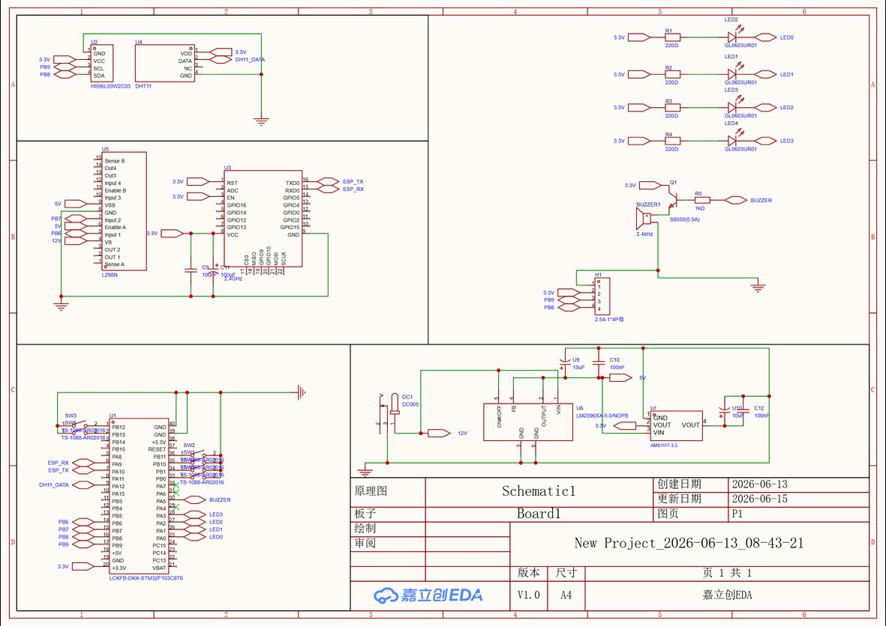

# 基于STM32的自动售货机

> **Auto Dealer Based on STM32** — 基于 STM32F103C8T6 的智能自动售货机，支持本地按键操控与 OneNET 云端远程控制。

[](https://www.st.com)
[](https://www.keil.com/)
[](https://www.espressif.com/)
[](https://open.iot.10086.cn/)
[](LICENSE)

---

## 📖 目录

- [项目简介](#项目简介)
- [功能特性](#功能特性)
- [硬件架构](#硬件架构)
- [系统框图](#系统框图)
- [引脚分配](#引脚分配)
- [固件说明](#固件说明)
- [快速开始](#快速开始)
- [目录结构](#目录结构)
- [物料清单](#物料清单)
- [PCB与Gerber](#pcb与gerber)
- [云平台配置](#云平台配置)
- [注意事项](#注意事项)

---

## 项目简介

本项目实现了一台基于 STM32F103C8T6 的智能自动售货机。用户可以通过 **本地按键** 浏览商品、选择数量并购买，也可以通过 **OneNET 云平台** 远程下发出货指令。OLED 屏幕实时显示商品信息、温湿度等数据，并通过 MQTT 协议将状态上传至云端。

本项目包含完整的 **固件源码**、**电路原理图**、**PCB 设计** 和 **Gerber 生产文件**，可直接复现。

---

## 功能特性

| 功能模块 | 说明 |
|---------|------|
| 🛒 **商品售卖** | 支持 4 通道商品（苹果/香蕉/橙子/芒果），本地按键 + 云端远程双模式控制 |
| 📺 **OLED 显示** | 0.96 寸 SSD1306 OLED，128×64 分辨率，中文界面，显示商品列表/库存/价格 |
| 🌡️ **环境监测** | DHT11 温湿度传感器，实时显示温湿度，超阈值蜂鸣器报警（温度>30°C 或湿度>90%） |
| 🌐 **WiFi 联网** | ESP8266-01S 模块，MQTT 协议连接 OneNET Studio 云平台 |
| ☁️ **云端控制** | 支持 OneNET 命令下发远程出货，定时上报库存/温湿度数据 |
| 🔊 **声光指示** | 8 路 LED 指示灯 + 有源蜂鸣器报警 |
| 🛡️ **库存管理** | 实时跟踪商品库存，售罄后自动锁定 |

---

## 硬件架构

- **主控**: STM32F103C8T6（Cortex-M3, 72MHz, 64KB Flash, 20KB SRAM）
- **显示**: 0.96" OLED SSD1306（I2C，4Pin）
- **通信**: ESP8266-01S（UART1, 115200bps，MQTT 协议）
- **传感器**: DHT11 数字温湿度传感器（单总线）
- **驱动**: L298N 双H桥驱动直流减速电机（正转出货）
- **输入**: 6 键独立按键（上翻/下翻/确认/返回/购物车+/购物车-）
- **输出**: 8 路 LED（商品/状态指示）+ 有源蜂鸣器
- **电源**: DC 12V 输入 → LM2596 5V → AMS1117 3.3V 三级供电

### 整机接线总览

> 点击图片可放大查看



---

## 引脚分配

下面是简化的引脚速查表，完整的芯片级引脚对照请参考下方的原理图：

| STM32 引脚 | 功能 | 连接目标 |
|-----------|------|---------|
| PA0 ~ PA7 | GPIO 输出 | LED0 ~ LED7（低电平点亮） |
| PA5 | GPIO 输出 | 蜂鸣器（⚠️ 与 LED5 共用，建议二选一） |
| PA9 | USART1_TX | ESP8266 RXD |
| PA10 | USART1_RX | ESP8266 TXD |
| PA12 | GPIO 输入 | DHT11 DATA（单总线，需 4.7KΩ 上拉） |
| PB0 | GPIO 输入 | 按键 OK（确认） |
| PB1 | GPIO 输入 | 按键 BACK（返回） |
| PB6 | GPIO 输出 | L298N IN1（电机正转） |
| PB7 | GPIO 输出 | L298N IN2（电机反转） |
| PB8 | GPIO 输出 | OLED SCL（软件 I2C 时钟） |
| PB9 | GPIO 输出 | OLED SDA（软件 I2C 数据） |
| PB10 | GPIO 输入 | 按键 CART+（购物车+） |
| PB11 | GPIO 输入 | 按键 CART-（购物车-） |
| PB12 | GPIO 输入 | 按键 UP（上翻） |
| PB13 | GPIO 输入 | 按键 DOWN（下翻） |

> 📖 完整的芯片引脚对照表（含电源/晶振/BOOT/SWD 等全部 48 脚）及原理图设计文档请参阅 **[schematic.md](Auto-Dealer-Based-On-STM32-main/schematic.md)**。

---

## 固件说明

### 开发环境

- **IDE**: Keil MDK 5（或兼容版本）
- **工具链**: Arm Compiler 5 / 6
- **固件库**: STM32F10x 标准外设库 (StdPeriph_Lib)
- **烧录工具**: ST-Link / J-Link（SWD 接口）

### 工程结构

```
Auto-Dealer-Based-On-STM32-main/
├── User/                  # 用户应用层
│   ├── main.c             # 主程序入口，UI 界面与主循环
│   ├── stm32f10x_it.c/h   # 中断服务程序
│   └── stm32f10x_conf.h   # 外设库配置文件
├── Hardware/              # 外设驱动层
│   ├── OLED.c/h           # SSD1306 OLED 驱动（软件 I2C）
│   ├── OLED_Font.h        # 中文字库
│   ├── ESP8266.c/h        # ESP8266 AT 指令 + MQTT 驱动
│   ├── DHT11.c/h          # DHT11 单总线驱动
│   ├── KEY.c/h            # 按键扫描驱动
│   ├── LED.c/h            # LED 驱动
│   ├── BEEP.c/h           # 蜂鸣器驱动
│   ├── ADC.c/h            # ADC 驱动
│   └── Serial.c/h         # 串口驱动
├── System/                # 系统层
│   ├── Delay.c/h          # 延时函数
│   ├── DMA.c/h            # DMA 配置
│   ├── Upload.c/h         # 定时上传 + TIM3 中断
│   ├── i2c.c/h            # 软件 I2C 实现
│   └── main.h             # 系统头文件
├── Start/                 # 启动文件
│   ├── core_cm3.c/h       # Cortex-M3 内核
│   ├── system_stm32f10x.c/h  # 系统时钟配置
│   └── stm32f10x.h        # 外设寄存器定义
├── Library/               # STM32F10x 标准外设库
│   └── stm32f10x_*.c/h    # GPIO/USART/TIM/SPI/I2C/ADC 等
└── 2.1.uvprojx             # Keil MDK 工程文件
```

### 关键逻辑

- **主循环** (`main.c`): 状态机模式，`x` 变量控制界面切换
  - `x=0`: 首页（显示温湿度 + 系统状态）
  - `x=1`: 商品列表页（上下翻选商品）
  - `x=2`: 购物车页（确认数量）
  - `x=4`: 出货中（电机转动 2.5 秒）
- **云端命令**: ESP8266 通过 MQTT 订阅 `DISPENSE_0/2/4/6` 命令，收到后自动进入出货流程
- **定时上报**: TIM3 每 5 秒触发中断 → `DataUpload()` 将温湿度/库存通过 MQTT 上传至 OneNET

---

## 快速开始

### 1. 硬件准备

按照 [原理图文档](Auto-Dealer-Based-On-STM32-main/schematic.md) 中的接线表连接各模块。确保：
- STM32 最小系统板正常工作
- OLED、ESP8266、DHT11 正确接线
- 电源三级供电（12V → 5V → 3.3V）正常

### 2. 固件编译

1. 使用 Keil MDK 打开 `Auto-Dealer-Based-On-STM32-main/2.1.uvprojx`
2. 检查 `ESP8266.c` 中的 WiFi 和 OneNET 配置是否正确
3. 编译工程（Project → Build Target）
4. 通过 SWD 烧录到目标板

### 3. WiFi & OneNET 配置

在 `Hardware/ESP8266.c` 中修改以下参数：

```c
/* WiFi 配置 */
const char* WIFI_SSID     = "你的WiFi名称";
const char* WIFI_PASSWORD = "你的WiFi密码";

/* OneNET Studio MQTT 配置 */
const char* ProductID  = "你的产品ID";
const char* DeviceName = "你的设备名称";
const char* DeviceKey  = "你的设备密钥";
```

### 4. 运行

上电后：
- OLED 显示 "Connect Wi-Fi"，等待 WiFi 连接
- 连接成功后自动连接 OneNET MQTT
- 首页显示温湿度和系统状态
- 通过按键或云端指令操作

### 5. PCB 打板

`Gerber/` 目录包含完整的生产文件，可直接提交给 PCB 厂商（如嘉立创）进行打板。详细说明参见 `Gerber/PCB下单必读.txt`。

---

## 目录结构

```
基于STM32的自动售货机/
├── README.md                              # 项目说明（本文件）
├── .gitignore                             # Git 忽略规则
├── LICENSE                                # 开源协议
├── Auto-Dealer-Based-On-STM32-main/       # 固件源码（Keil MDK 工程）
│   ├── User/                              #   用户层代码
│   ├── Hardware/                          #   外设驱动
│   ├── System/                            #   系统层
│   ├── Start/                             #   启动文件
│   ├── Library/                           #   STM32 标准外设库
│   ├── Objects/                           #   编译输出（含 .hex 固件）
│   ├── Listings/                          #   链接 Map 文件
│   ├── schematic.md                       #   原理图设计文档
│   └── 2.1.uvprojx                        #   Keil 工程文件
├── Schematic/                             # 原理图图片
│   └── schematic_small.jpg                #   原理图预览
├── PCB/                                   # PCB 设计文件
│   ├── New Project_*.epru                 #   立创EDA 工程文件
│   ├── project2.json                      #   工程配置
│   └── IMAGE/                             #   PCB 预览图（待补充）
├── Gerber/                                # PCB 生产文件（可直接打板）
│   ├── Gerber_TopLayer.GTL                #   顶层铜皮
│   ├── Gerber_BottomLayer.GBL             #   底层铜皮
│   ├── Gerber_TopSilkscreenLayer.GTO      #   顶层丝印
│   ├── Gerber_TopSolderMaskLayer.GTS      #   顶层阻焊
│   ├── Gerber_BottomSolderMaskLayer.GBS   #   底层阻焊
│   ├── Gerber_BoardOutlineLayer.GKO       #   板框
│   ├── Gerber_DrillDrawingLayer.GDD       #   钻孔图
│   ├── Drill_PTH_Through.DRL              #   钻孔文件
│   └── PCB下单必读.txt                    #   打板说明
└── Docs/                                  # 文档
    └── BOM_Board1_PCB1.xlsx              #   BOM 物料清单
```

---

## 物料清单

| 类别 | 关键物料 | 数量 | 备注 |
|------|---------|------|------|
| 主控 | STM32F103C8T6 最小系统板 | 1 | LQFP-48 |
| 显示 | 0.96" OLED SSD1306 I2C | 1 | 128×64, 蓝色/白色 |
| WiFi | ESP8266-01S | 1 | 8Pin 排针 |
| 传感器 | DHT11 温湿度模块 | 1 | 单总线 |
| 电机驱动 | L298N 模块 | 1 | 双H桥 |
| 电机 | 直流减速电机 12V ~200RPM | 1 | |
| 电源 | LM2596 DC-DC 降压模块 | 1 | 12V→5V |
| 电源 | AMS1117-3.3 LDO | 1 | 5V→3.3V |
| 按键 | 6×6mm 轻触开关 | 6 | |
| LED | 0805 贴片 LED（红/绿/黄） | 8 | 含限流电阻 220Ω |
| 蜂鸣器 | 有源蜂鸣器 3.3V | 1 | |
| 电源 | DC 12V/2A 适配器 | 1 | 5.5×2.1mm |

> 完整 BOM 参见 `Docs/BOM_Board1_PCB1.xlsx`

---

## PCB与Gerber

PCB 使用 **立创EDA** 设计，Gerber 文件已导出，可直接提交打板：

- **Gerber 文件**: `Gerber/` 目录包含所有生产层
- **PCB 工程**: `PCB/` 目录包含立创EDA 工程文件（`.epru`）
- **PCB 预览图**: `PCB/IMAGE/`（待补充 2D/3D 渲染图）

### Gerber 文件清单

| 文件 | 说明 |
|------|------|
| `Gerber_TopLayer.GTL` | 顶层铜皮 |
| `Gerber_BottomLayer.GBL` | 底层铜皮 |
| `Gerber_TopSilkscreenLayer.GTO` | 顶层丝印 |
| `Gerber_BottomSilkscreenLayer.GBO` | 底层丝印 |
| `Gerber_TopSolderMaskLayer.GTS` | 顶层阻焊 |
| `Gerber_BottomSolderMaskLayer.GBS` | 底层阻焊 |
| `Gerber_TopPasteMaskLayer.GTP` | 顶层钢网 |
| `Gerber_BoardOutlineLayer.GKO` | 板框 |
| `Gerber_DrillDrawingLayer.GDD` | 钻孔图 |
| `Drill_PTH_Through.DRL` | 通孔钻孔 |
| `Drill_PTH_Through_Via.DRL` | 过孔钻孔 |

---

## 云平台配置

本项目使用 **中国移动 OneNET Studio** 作为物联网云平台。

### MQTT 主题

| 主题 | 方向 | 说明 |
|------|------|------|
| `$sys/{PID}/{Device}/dp/post/json` | 设备→云 | 数据上报（温湿度/库存） |
| `$sys/{PID}/{Device}/cmd/request/+` | 云→设备 | 命令下发订阅 |

### 上报数据格式 (JSON)

```json
{
  "temp": 25.3,
  "humi": 58.2,
  "Apple": 10,
  "Banana": 8,
  "Orange": 10,
  "Mango": 9
}
```

### 下发命令

| 命令 | 说明 |
|------|------|
| `DISPENSE_0` | 出货：苹果（通道0） |
| `DISPENSE_2` | 出货：香蕉（通道2） |
| `DISPENSE_4` | 出货：橙子（通道4） |
| `DISPENSE_6` | 出货：芒果（通道6） |

---

## 注意事项

1. **PA5 引脚冲突**: PA5 同时驱动 LED5 和蜂鸣器，建议在 PCB 上通过跳线或 0Ω 电阻二选一焊接
2. **ESP8266 供电**: ESP8266 峰值电流约 300mA，AMS1117-3.3 需留足余量，建议在 ESP8266 VCC 旁并联 100μF+100nF 电容
3. **共地**: 所有模块（12V/5V/3.3V）的 GND 必须接在一起
4. **WiFi 凭证**: 发布前请清除 `ESP8266.c` 中的 WiFi 密码和 OneNET 密钥，改为占位符
5. **电机干扰**: 直流电机为强干扰源，电机引线应远离信号线（尤其是 DHT11 单总线和 I2C 线）
6. **I2C 上拉**: 确认 OLED 模块板上是否已集成 I2C 上拉电阻，若无须外加 4.7KΩ×2 至 3.3V
7. **SWD 调试口**: 务必预留 SWDIO(PA13)、SWCLK(PA14)、3.3V、GND 四线调试接口

---

## 许可证

本项目采用 [MIT License](LICENSE) 开源。

---

> **相关文档**: 
> - [原理图设计文档](Auto-Dealer-Based-On-STM32-main/schematic.md)
> - [快速接线参考](Auto-Dealer-Based-On-STM32-main/schematic.md#附录-快速接线表-焊接参考)
> - [BOM 物料清单](Docs/BOM_Board1_PCB1.xlsx)
